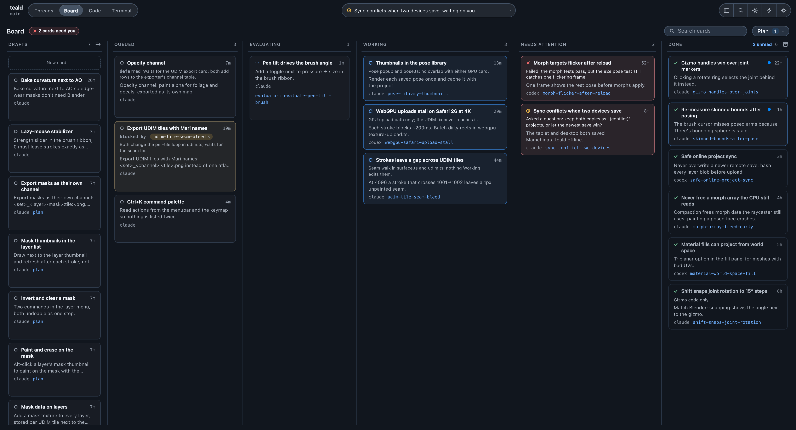
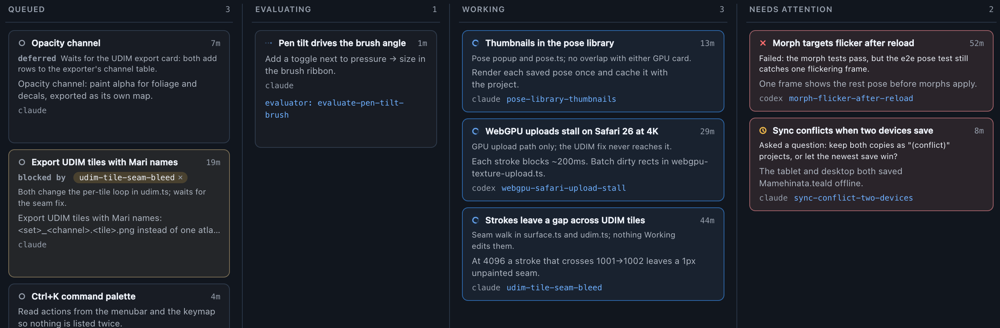
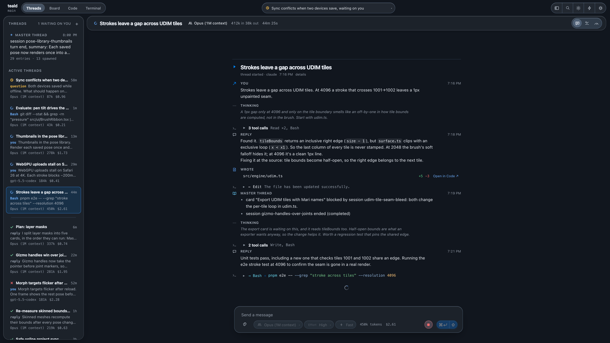
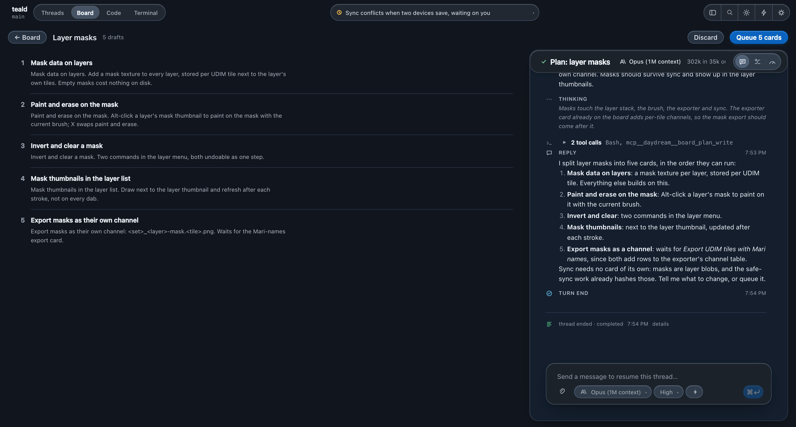
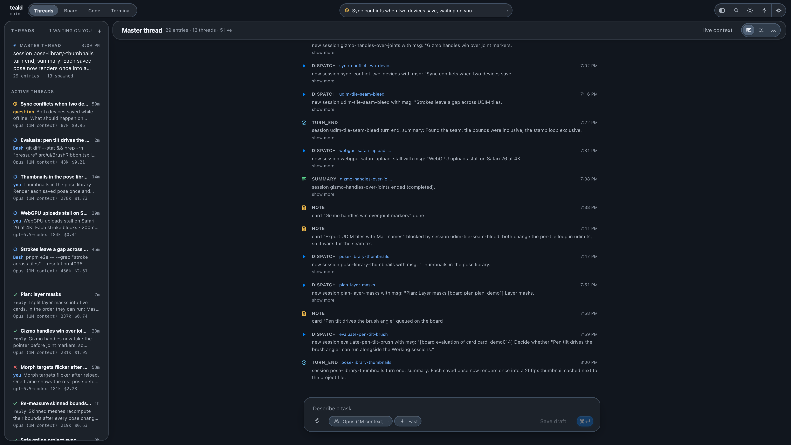

<p align="center">
  
</p>

<h1 align="center">Daydream Code</h1>

<p align="center">
  <strong>Run several coding agents on one repo, with one memory they all share.</strong>
</p>

<p align="center">
  A desktop app and CLI for Claude and Codex. Every session reports back to a project-wide master thread,<br>
  so the fifth agent you start already knows what the first four did.
</p>

<p align="center">
  <a href="#quick-start">Quick start</a> ·
  <a href="#a-tour">Tour</a> ·
  <a href="#cli">CLI</a> ·
  <a href="#how-the-memory-model-works">How the memory works</a> ·
  <a href="#security-model">Security</a>
</p>

<picture>
  <source media="(prefers-color-scheme: light)" srcset="docs/images/board-light.png">
  
</picture>

<p align="center"><sub>The board in the middle of a working day. The project is a demo texture painter; the tasks are made up.</sub></p>

> [!IMPORTANT]
> Daydream Code is currently a source-built project, not a packaged release. It is suitable for trusted local development environments. Review the [security model](#security-model) before running agents or exposing the API.

## Why

A coding agent is good at one task. Run four of them on the same repository and they start to trip over each other. None of them knows what the others are doing, two of them edit the same file, and each new session starts from nothing.

Daydream Code gives every project a master thread. Sessions fork it when they start, report to it when they finish, and hear from their siblings between turns. Every prompt, tool call and result goes into an append-only journal, and nothing is ever deleted.

## A tour

### Queue work and let the board decide what can run



With kanban mode on, every task becomes a card. Before a card starts, an evaluator session reads what is already running and decides whether the card can start now. If a running session is touching the same code, the card waits for that session. If an earlier card will conflict with it, it waits behind that card.

Above, *Export UDIM tiles with Mari names* is blocked on the session fixing `udim.ts`. *Opacity channel* waits behind the export card, because both add rows to the exporter's channel table. When a blocker finishes, the waiting card is evaluated again without you touching it.

Cards that need a person (a question, a failed run) collect in Needs Attention. Finished cards you haven't opened yet keep a dot until you do.

### Watch any session, down to the tool call



A thread shows the agent's thinking, its replies, every tool call, and each file it wrote with a line count and a link into the code view. Master-thread updates appear inline, so you can watch a session find out that another card is waiting on it. You can send it a message while it runs to steer it.

### Plan a feature, then queue it in one go



Hand plan mode a large prompt. A planner session reads the code and writes numbered draft cards in the order they can run. You can edit them, reorder them, or talk them over with the planner in the right-hand pane. Nothing starts until you press **Queue**.

### One memory for the whole project



The master thread records every dispatch, turn summary, finished session and board decision. A new session forks it, so it starts out knowing what the project already knows. When the thread gets long it is compacted copy-on-write: a digest replaces the old prefix in the live context, and the full history stays on disk and readable.

## Everything else

- **Claude or Codex, per session.** Pick the driver, model and effort for each task, and continue any session later without rebuilding its context.
- **A lossless journal.** Prompts, turns, tool calls, results, questions, errors and usage go into an append-only SQLite journal that agents can search.
- **Several projects at once.** The desktop app keeps each project's core loaded, shows activity across all of them, and switches between them without stopping anything.
- **Images.** Paste, drop or pick PNG, JPEG, GIF and WebP attachments.
- **Agents that talk to each other and to you.** Sessions can ask you a question, ask or message a sibling, search earlier work, and pin notes to the master thread.
- **Quick actions.** Save project commands as one-click buttons. Agents can suggest them through the same tools.
- **Plugins all the way down.** Storage, drivers, tools, compaction, routes, session orchestration and the HTTP transport are each a config entry you can swap.

## Quick start

### Prerequisites

- [Node.js](https://nodejs.org/) 22 or newer
- [pnpm](https://pnpm.io/) 9 or newer
- Git
- Credentials for at least one model provider

The default driver is Claude and uses the local Claude Code authentication available to the process. The optional Codex driver uses `OPENAI_API_KEY`. Start Daydream Code from a shell where the provider you intend to use is already authenticated.

### Run the desktop app

```bash
git clone https://github.com/nokusukun/daydream-code.git
cd daydream-code
pnpm install
pnpm build
pnpm -C apps/desktop dev
```

On first launch, choose a project folder. Daydream Code creates that project’s local state on demand; it does not move or copy the project.

Useful desktop shortcuts on macOS:

| Shortcut | Action |
| --- | --- |
| `⌘N` | Start a new run |
| `⌘K` | Open the command palette |
| `⌘B` | Show or hide the sidebar |
| `⌘⇧O` | Switch project |
| `⌘⇧E` | Open the file tree |
| `⌘,` | Open settings |
| `⌘⌥I` | Open developer tools |

On Windows and Linux, use `Ctrl` in place of `⌘` for the in-app shortcuts.

### Build and run the production renderer locally

```bash
pnpm build
pnpm -C apps/desktop build
pnpm -C apps/desktop start
```

This produces and runs an unpackaged local build. Installer, signing, notarization, and release automation are not part of the repository yet.

## CLI

Build the workspace first, then invoke the CLI entry point:

```bash
pnpm build
node apps/cli/dist/bin.js --help
```

Common commands:

```bash
# Start a session in the current project.
node apps/cli/dist/bin.js run "fix the failing tests"

# Select a project, driver, model, and explicit session name.
node apps/cli/dist/bin.js run "audit the API" \
  --project /path/to/project \
  --driver claude \
  --model claude-sonnet-4-6 \
  --name audit-api

# Attach one or more images. Paths are resolved from the current directory.
node apps/cli/dist/bin.js run "recreate this layout" \
  --image ./reference.png \
  --image ./mobile.png

# Continue a session by its name or id.
node apps/cli/dist/bin.js continue audit-api "also document the findings"

# Inspect project state.
node apps/cli/dist/bin.js sessions
node apps/cli/dist/bin.js models
node apps/cli/dist/bin.js master
node apps/cli/dist/bin.js master --all
node apps/cli/dist/bin.js journal audit-api

# Diagnose the plugin composition.
node apps/cli/dist/bin.js dump-config
node apps/cli/dist/bin.js fiber-state
```

Every command accepts `--project <path>`; the default is the current working directory. `run` and `continue` stay attached until the session finishes and can present agent questions when the terminal is interactive. Add `--quiet` to suppress streamed journal events.

## How the memory model works

### Master thread

Each project has one long-lived master thread. Dispatches, turn summaries, completed-session summaries, notes, and inter-session messages are appended as work happens. A new session forks the current live context by reference, so it begins with the project’s accumulated knowledge rather than an isolated prompt.

The default compaction policy triggers above 50,000 estimated tokens and aims for a 30,000-token live context while retaining a 10,000-token verbatim tail. Compaction appends a digest that supersedes an older prefix; it never deletes the underlying thread entries or session journals.

### Sessions

A session is a resumable run owned by a model driver. Session names are derived from their task and are unique within the project. The CLI, API, desktop UI, and recall tools accept names anywhere they accept session ids.

At turn boundaries, a running session receives master-thread entries added since its last cursor. This is how concurrently running sessions learn what their siblings dispatched, decided, or completed.

### Journal

The journal is the source of truth for session activity. SQLite triggers enforce append-only behavior. Agents can search it, page through a session, inspect a window around a matching event, read full master history, and publish coordination notes without loading the entire database into context.

## Configuration

Configuration is a YAML list of plugin entries. Layers are composed in this order:

1. the built-in base bundle;
2. `~/.daydream-code/config.yml` for user-wide changes;
3. `<project>/.daydream-code/config.yml` for project changes; and
4. CLI `--enable` and `--disable` overrides.

Rows are matched by `id`. A later row replaces the earlier row’s entire `config` object; configuration is intentionally not deep-merged. Use `dump-config` to see the exact composition that will boot.

For example, this project configuration enables Codex and changes the master-thread budget:

```yaml
- id: driver-codex
  disabled: false

- id: compaction
  config:
    budgetTokens: 80000
    targetTokens: 45000
    keepTokens: 15000
```

To make Codex the default for new sessions, select it in desktop settings. The project’s default driver and model are stored in its SQLite project record; plugin implementation settings remain in the YAML layers.

### Kanban mode

Kanban mode turns every new thread into a **card** that is evaluated before it runs. Cards move through Drafts, Queued, Evaluating, Working, Needs Attention and Done. The evaluator is a real session on the project's agent: it reads what the Working sessions are doing (their tasks, summaries and the files they have written), judges whether the new task can run alongside them, and reports through a `board_verdict` tool. A card can be **blocked** by one or more Working sessions and is re-evaluated once every blocker has finished; a follow-up on a Done card re-queues it.

It is off by default. Turn it on for a project by enabling the first four rows together, in the project layer or from the **kanban** section of desktop settings. The fifth, `board-planner`, adds plan mode, and the settings toggle turns it on with the rest:

```yaml
- id: board
  disabled: false
- id: board-evaluator
  disabled: false
  config:
    driver: claude        # optional; the project default otherwise
    timeoutMs: 600000     # an evaluator still running after this goes to Needs Attention
- id: board-writeback
  disabled: false
- id: board-routes
  disabled: false
- id: board-planner       # plan mode; the board runs without it
  disabled: false
```

With the mode on, `daydream-code run` and `POST /api/sessions` answer with the card they became instead of a session (the HTTP status is 202), the desktop composer's button reads **Queue**, and a **Board** mode appears in the window. The board surface is `GET /api/board` and `/api/board/cards/...`; the design record is in `PLAN-kanban.md`.

## Local data

Daydream Code stores project-owned state under the project root:

```text
<project>/.daydream-code/
├── store.sqlite       # projects, sessions, journal, threads, and quick actions
├── store.sqlite-wal   # SQLite write-ahead log while the store is open
├── store.sqlite-shm
├── blobs/             # content-addressed image attachments
├── config.yml         # optional project plugin overrides
└── .gitignore         # generated exclusions for the database and blobs
```

Image bytes are kept out of SQLite. Thread and journal records store content-addressed references, while Claude receives base64 image blocks and Codex receives a workspace-local image path.

To back up an inactive project, copy its entire `.daydream-code` directory. For a live project, use a SQLite-aware backup rather than copying only `store.sqlite`, because committed data may still be in the WAL file.

## Local HTTP and WebSocket API

The server plugin is disabled by default. Start it for one project with:

```bash
node apps/cli/dist/bin.js serve --project /path/to/project
```

By default it listens on `127.0.0.1:4870`. `GET /health` is public; capability routes live under `/api/*`, and `/stream` provides live WebSocket events.

Set a bearer token in configuration before changing the bind address:

```yaml
- id: server
  config:
    host: 127.0.0.1
    port: 4870
    token: replace-with-a-long-random-secret
    bodyLimit: 25165824
```

Authenticated requests may send `Authorization: Bearer <token>`. Query-string tokens are supported for WebSocket clients but are easier to leak through logs and should be avoided where a header is possible.

## Architecture

The kernel is deliberately small: it provides contexts, services, fibers, lifecycle effects, and event dispatch. Nearly everything else is mounted as a plugin.

```text
apps/
├── cli/          command-line host
└── desktop/      Electron main process and React renderer

packages/
├── kernel/       contexts, fibers, effects, and events
├── boot/         configuration layers and plugin loading
├── config/       typed plugin-setting declarations
├── shared/       durable domain types
├── store/        per-project SQLite database and migrations
├── blobs/        content-addressed image storage
├── journal/      append-only event journal
├── thread/       master threads, forks, and writeback
├── tokens/       token estimation
├── normalize/    persistence-boundary message normalization
├── compaction/   copy-on-write master-thread compaction
├── summarize/    turn, title, and session summarization
├── questions/    user-question lifecycle
├── asks/         cross-session question lifecycle
├── actions/      persisted quick actions and agent tools
├── tools/        recall, user-question, and sibling tools
├── driver/       Claude, Codex, and scripted mock adapters
├── workspace/    read-only working-tree and diff views
├── routes/       transport-independent route registry
├── session/      session orchestration and recovery
├── settings/     live configuration inspection and writes
└── server/       Fastify HTTP and WebSocket transport
```

The default composition is defined in [`packages/boot/src/base.ts`](packages/boot/src/base.ts). A plugin with unmet dependencies remains `pending` rather than partially starting; `fiber-state` reports the missing services or load error.

## Security model

Daydream Code coordinates coding agents that can edit files and execute commands. Treat it as a local developer tool with the same trust level as the model provider’s coding agent.

- **Sessions default to `auto` permissions.** Claude runs with bypassed permission checks; Codex runs with `danger-full-access` and no approval prompts. Use only on repositories and tasks you trust.
- **Quick actions are host commands.** Clicking a saved command runs it at the active project root in the host login shell. It does not inherit the sandbox of the agent that suggested it. Review the command and its attribution before running it.
- **The API is not a public multi-tenant boundary.** It binds to loopback by default and has no token unless you configure one. Never bind it to a non-loopback interface without a strong token and an appropriate trusted-network boundary.
- **Keep provider credentials outside project config.** Use the providers’ normal environment or local authentication. If the server needs a token, prefer the user-level config file, restrict its file permissions, and never commit it or `.daydream-code` runtime state.
- **History is intentionally durable.** Prompts, tool arguments, tool results, and agent output can contain sensitive material. Protect backups and delete project state deliberately when retention is no longer appropriate.

## Development

```bash
# Type-check and compile all project references.
pnpm build

# Run the test suite.
pnpm test

# Build the Electron main process and production renderer.
pnpm -C apps/desktop build
```

The desktop app and Node test runner use different native ABIs for `better-sqlite3`. The desktop `dev` and `start` scripts switch to the Electron ABI automatically. Before running the Node-based test suite after launching Electron, switch it back:

```bash
pnpm -C apps/desktop rebuild:node
pnpm test
```

The next desktop `dev` or `start` command switches it to Electron again.

Tests live beside their owning workspace under `packages/*/tests`, `apps/cli/tests`, and `apps/desktop/tests`. The root Vitest configuration is the canonical full-suite entry point.

## Troubleshooting

### The desktop UI changed but a new API or IPC feature does not work

Vite can refresh the renderer, but it cannot replace the Electron main process or a running project core. Fully quit the app and restart `pnpm -C apps/desktop dev` after changes to Electron code, routes, migrations, drivers, or the base plugin bundle.

### `better-sqlite3` reports `NODE_MODULE_VERSION` mismatch

The native binding is built for the wrong runtime. Use the matching rebuild command:

```bash
# For tests and the CLI
pnpm -C apps/desktop rebuild:node

# For Electron (normally automatic)
pnpm -C apps/desktop rebuild:electron
```

### A plugin is missing even though it appears in config

Run:

```bash
node apps/cli/dist/bin.js dump-config
node apps/cli/dist/bin.js fiber-state
```

The first command shows which layer won; the second shows whether the plugin is active, pending on a missing service, disabled, or failed during load.

## Project status

Daydream Code is under active development. Database migrations are automatic, but there is not yet a stable public release contract, packaged installer, CI release pipeline, or published license. Pin deployments to a known commit and back up `.daydream-code` before testing migrations on important project history.
